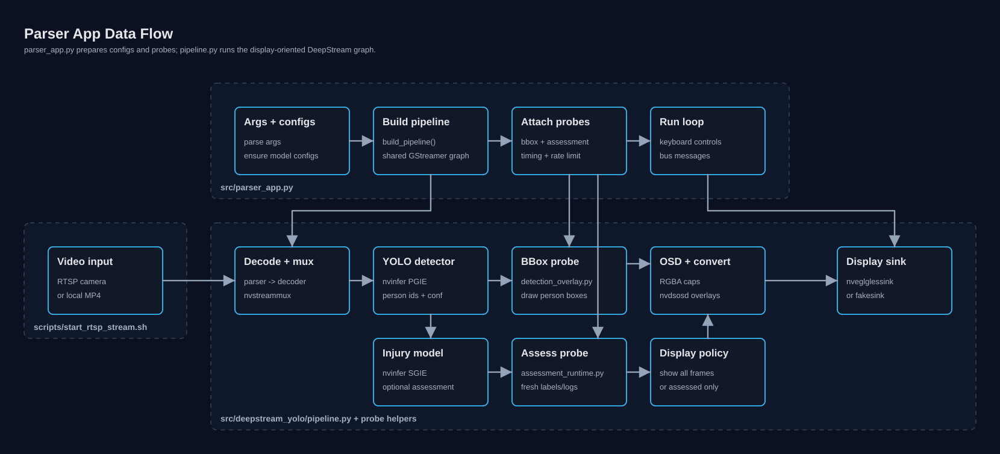
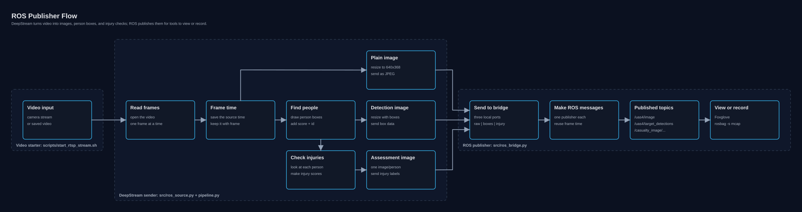

# DeepStream YOLO Parser

Development container and scripts for running YOLO detections, injury
assessment, RTSP video input, and ROS Humble publishing through NVIDIA
DeepStream.

## Quickstart

Put a video in `streams/`, then run these from the host. Nothing else is
required — no container shell, no manual export step.

```bash
scripts/setup.sh      # build, compile, export, verify. Safe to re-run.
scripts/parser.sh     # detections + assessment in a window
scripts/ros.sh        # RTSP + ROS Humble + Foxglove stack
```

That is the whole workflow. `setup.sh` is the only one you need before either
run command, and both run commands are self-contained: they start the RTSP
server themselves and shut everything down on Ctrl-C.

Common variations:

```bash
scripts/parser.sh --record                  # also write an annotated mp4
scripts/parser.sh --video streams/other.mp4 # a different video
scripts/ros.sh --bag                        # also record an MCAP bag
```

To use a new detector checkpoint, point `--model` at it. Only that model is
rebuilt; the image, parser library, and every other export are left alone:

```bash
scripts/setup.sh --model runs/detect/train/weights/best.pt
scripts/parser.sh --model runs/detect/train/weights/best.pt
```

Each command takes `--help`. `setup.sh` also takes `--only`, `--skip`, and
`--force` to run or redo one stage at a time:

```bash
scripts/setup.sh --only verify      # re-check the pipeline, nothing else
scripts/setup.sh --force parser     # rebuild just the parser library
```

### What setup does

Every stage is stamped against its real inputs, so a second run is close to a
no-op and only genuinely changed work is redone.

| Stage | Produces | Redone when |
| --- | --- | --- |
| `image` | `deepstream-work:<DS_VERSION>` | Dockerfile or compose file changes |
| `parser` | `lib/libnvdsinfer_custom_impl_Yolo.so` | CUDA version or DeepStream-Yolo ref changes |
| `models` | `models/*.onnx`, `configs/generated/*` | the model, resolution, or source geometry changes |
| `verify` | TensorRT engine, plus a pass/fail | always (it is the proof it still runs) |

`env` (the `.venv-yolo-<pyver>/` export environment, several GB of torch and
CUDA wheels) is not in the default sequence. The `models` stage builds it
automatically the moment a model actually needs exporting, so runs that only
use already-exported models never pay for it. Pre-warm it with
`scripts/setup.sh --only env` if you want to.

### Defaults

With no arguments the commands use the `yolo12n.pt` detector and, when
`streams/` holds exactly one video, that video. `streams/` is gitignored, so
nothing is hardcoded to one machine's media; pass `--video`/`--stream` when the
directory holds more than one file.

The container targets **DeepStream 7.1 by default**. The release is a build
argument, so 8.0 and 9.0 build from the same Dockerfile:

```bash
scripts/setup.sh                      # DeepStream 7.1
DS_VERSION=9.0 scripts/setup.sh       # DeepStream 9.0
```

The image is tagged `deepstream-work:<DS_VERSION>`, so several releases can
coexist. See [docker/README.md](docker/README.md) for what changes per release.

## Layout

```
scripts/
  setup.sh          staged, idempotent setup (and --clean, its inverse)
  parser.sh         RTSP server + display app
  ros.sh            the full RTSP/ROS/Foxglove stack
  rtsp_server.py    serves a local video over RTSP, looping
  ros_service.sh    the ROS container's entrypoints: bridge | foxglove | bag
  smoke_pipeline.py headless bounded run; setup's verify stage
  test_klt.sh       run the motion detector on a video, get a video back
  compare_klt.sh    the same, or a parameter sweep tiled into a grid
  compare_motion.sh all four approaches side by side
  lib/common.sh     shared shell helpers, sourced by the three entrypoints
  setup/            one script per setup stage, plus prepare_models.py
src/
  parser_app.py     display-oriented DeepStream app
  ros_source.py     DeepStream frame source for ROS publishing
  ros_bridge.py     ROS Humble publisher bridge
  deepstream_yolo/  the package all three share
    approaches/     interchangeable motion detectors, one module each
eval/               the harness that scores them; see eval/README.md
docker/             Dockerfiles for the DeepStream and ROS Humble images
configs/generated/  nvinfer configs written by the models stage
models/ lib/        exported models and the compiled bbox parser
```

The two normal runtime workflows are:

- Parser app: `scripts/parser.sh` for a display window and console logs.
- ROS publisher: `scripts/ros.sh` for the RTSP server, DeepStream frame source,
  ROS publisher, and Foxglove Bridge together.

The ROS publisher workflow publishes detections as `TargetBoxArray` messages
and assessments as `CasualtyImageCompressed` messages from a ROS Humble
container.

### Entrypoints

The three commands in the quickstart are the intended interface:

- `scripts/setup.sh`: staged, idempotent setup.
- `scripts/parser.sh`: RTSP server plus the display app.
- `scripts/ros.sh`: the full RTSP/ROS/Foxglove stack.

They orchestrate the underlying pieces, each of which still works on its own:

- `src/parser_app.py`: display-oriented DeepStream app.
- `src/ros_source.py`: DeepStream frame source for ROS publishing.
- `src/ros_bridge.py`: ROS Humble publisher bridge.
- `scripts/setup/`: the individual setup stages, one script each.

## Manual Setup

`scripts/setup.sh` runs all of this for you (`scripts/setup.sh --help` lists the
stages and their options); the steps below are here for when you want one of
them on its own. Each is individually idempotent, so running one directly costs
no more than the stage would.

Build the DeepStream development image from the host (this is setup's `image`
stage); for the ROS publisher workflow, build the ROS Humble image too:

```bash
docker compose build                  # deepstream-work:7.1
docker compose --profile ros build    # adds the ROS Humble image
```

The ROS Humble image includes Foxglove Bridge for visualization and needs a
colcon-built `cdcl_umd_msgs` workspace. `scripts/ros.sh` finds it automatically,
searching `~/ros2_ws`, `~/*/ros2_ws`, and `~/*/*/ros2_ws` for a workspace that is
actually built (`install/setup.bash` and `install/cdcl_umd_msgs` both present).
Set `CDCL_ROS_WS=/path/to/ros2_ws` to override. It is checked up front rather
than letting the bridge fail on the import several seconds in.

The workspace is mounted **at the path it was built at**, not at a fixed one.
`colcon build --symlink-install` writes absolute symlinks into the workspace's
own `build/` tree, so mounting it anywhere else leaves them dangling — and that
failure is quiet: sourcing `setup.bash` prints `not found` per symlink, still
exits 0, and leaves `PYTHONPATH` unset, so the bridge dies on
`import cdcl_umd_msgs` with nothing pointing at the mount path as the cause.
`ros.sh` recovers the original prefix from those symlinks and reproduces it, so
a workspace built inside some other container still works unchanged.

This matters on Ubuntu 24.04, where there are no ROS 2 Humble packages at all
(Humble is Jammy-only; Noble's distro is Jazzy). The workspace is normally built
inside a Humble container there, which is exactly the case that leaves a
container-specific path baked into `install/`.

Enter the DeepStream development container:

```bash
docker compose run --rm deepstream-dev bash
```

Inside the container, build the custom YOLO parser library:

```bash
scripts/setup/yolo_parser.sh          # skipped if already current
scripts/setup/yolo_parser.sh --force  # rebuild regardless
```

Export a YOLO model and generate DeepStream configs:

```bash
scripts/setup/yolo_export.sh yolo12n.pt 640
```

Export the injury assessment model:

```bash
scripts/setup/injury_model.sh models/injury.pt 8
```

Or do both through the same cache the apps use at startup:

```bash
python3 scripts/setup/prepare_models.py --model yolo12n.pt --long-side 640
```

Generated configs are written to `configs/generated/`. The export scripts manage
the virtualenv (`.venv-yolo-<pyver>/`, keyed by Python version) automatically
and do not require activating one.

## Video Input

RTSP is the default and preferred input path for both workflows.
`scripts/parser.sh` and `scripts/ros.sh` start the server themselves, so this
section only matters when running the pieces separately.

Start a local RTSP stream from a DeepStream container shell:

```bash
python3 scripts/rtsp_server.py                     # the video in streams/
python3 scripts/rtsp_server.py streams/my-video.mp4
```

The mount name is the video's basename, so serving `streams/my-video.mp4` gives:

```text
rtsp://127.0.0.1:8555/my-video
```

The server and the app defaults derive that URL from the same file, so neither
has to be told. Override the port or mount explicitly:

```bash
python3 scripts/rtsp_server.py streams/my-video.mp4 --port 8560 --mount test
```

Then pass the matching RTSP URL with `--stream`:

```bash
python3 src/parser_app.py --stream rtsp://127.0.0.1:8560/test
docker compose --profile ros run --rm deepstream-ros-source \
  python3 src/ros_source.py --stream rtsp://127.0.0.1:8560/test
```

For quick debugging, both DeepStream apps can also read a local file directly:

```bash
python3 src/parser_app.py --stream streams/my-video.mp4
docker compose --profile ros run --rm deepstream-ros-source \
  python3 src/ros_source.py --stream streams/my-video.mp4
```

Local-file input is useful for development, but RTSP better matches the live
pipeline: it is paced by the stream clock, drops late frames instead of queueing
them, and can expose network/reference timestamp metadata.

## Parser App



`scripts/parser.sh` is the one-command form: it serves the video over RTSP,
starts this app against it, and stops both together. To run the app alone,
from a DeepStream container shell with an RTSP server already up:

```bash
python3 src/parser_app.py
```

The plain command defaults to:

```bash
python3 src/parser_app.py \
  --model yolo12n.pt \
  --long-side 640 \
  --enable-assessment
```

`--stream` defaults to the RTSP URL for whatever video is in `streams/`.

Useful parser options:

```bash
python3 src/parser_app.py --no-assessment
python3 src/parser_app.py --show-assessed-only
python3 src/parser_app.py --rtsp-latency-ms 0
python3 src/parser_app.py --show-gst-scan-warnings
python3 src/parser_app.py --record
python3 src/parser_app.py --record outputs/run42.mp4
python3 src/parser_app.py --help
```

`--record` writes the annotated video (detection boxes and assessment text
burned in) to an mp4. With no path it auto-names one under `outputs/`. The
recording branch taps the frame after `nvdsosd` and stays on the GPU, so it
costs a hardware encode rather than a readback.

Recording needs a clean shutdown to finalize the mp4 container, or the file has
no moov atom and will not play. Quitting with `q`, Ctrl-C, `kill`, `docker
stop`, or closing the terminal all take that path: the app handles SIGINT,
SIGTERM, and SIGHUP from inside the GLib loop and drains the pipeline before
exiting. `kill -9` still cannot be caught, so it still truncates the file. A
second Ctrl-C during shutdown exits immediately if teardown is itself stuck.

By default, every display frame is shown; assessment overlay text appears only
on frames where fresh assessment tensor output is present. Use
`--show-assessed-only` to display only frames with updated assessments.

Assessment logs are grouped by frame timestamp:

```text
ASSESS frame=915 timestamp=22:46:20.242Z timestamp_source=ref detect_ms=4.26 detect_fps=234.74 assess_ms=7.58 assess_fps=131.93
  object=0 bbox=1278,358,362,128 person 0 injuries: | manikin  hem-  resp- | head-  torso- | upper+  lower+  eyes_nt
  object=1 bbox=562,639,335,131 person 1 injuries: | human  hem-  resp- | head-  torso+ | upper+  lower+  eyes_nt
```

`object=` matches the `person #` assessment label. By default, every fresh
assessment for every frame is logged. Set `--assessment-log-interval` to a
positive number to sample logs, or a negative number to disable assessment logs.
`detect_ms` is wall-clock time from mux output to detection output, and
`assess_ms` is wall-clock time from detection output to assessment output. The
matching FPS values are computed from those stage times.

## ROS Publisher



The editable draw.io sources and preview generator live in
`outputs/diagrams/`.

The ROS publishing workflow uses two containers:

- `deepstream-ros-source`: runs `python3 src/ros_source.py`, which starts
  `src/ros_source.py`. It forks raw, detect, and assess frame outputs,
  downsizes each image to `640x368`, JPEG-compresses them, and sends frame
  metadata over local TCP.
- `ros-humble-publisher`: runs `scripts/ros_service.sh bridge`, which starts
  `src/ros_bridge.py`. It receives those frames and publishes ROS Humble
  `cdcl_umd_msgs` messages with the JPEG image embedded in each message.

`scripts/ros.sh` starts those containers plus the RTSP server and Foxglove
Bridge. With `--bag`, it also runs `scripts/ros_service.sh bag` to record all ROS
topics to MCAP.

From a host shell, start the full RTSP, ROS publisher, Foxglove, and DeepStream
source stack:

```bash
scripts/ros.sh
```

Press Ctrl-C in that shell to stop and remove everything it started. To also
record all ROS topics to an MCAP bag under `outputs/rosbags/`:

```bash
scripts/ros.sh --bag
```

To serve a different video (the mount name follows the filename):

```bash
scripts/ros.sh --video streams/my-video.mp4
```

Before starting anything, `ros.sh` checks that the `cdcl_umd_msgs` workspace
exists and that every port it needs is free, so a missing workspace or a
leftover container is reported up front instead of part-way through bring-up.
If any component then exits, the rest are torn down rather than left running as
a half-working stack.

Connect Foxglove Studio to:

```text
ws://localhost:8765
```

To run the components separately for debugging, start the publisher, Foxglove,
and DeepStream source from separate host shells:

```bash
docker compose --profile ros run --rm ros-humble-publisher
```

```bash
docker compose --profile ros run --rm ros-foxglove-bridge
```

```bash
docker compose --profile ros run --rm deepstream-ros-source
```

Published topics:

```text
/uas4/image
/uas4/target_detections
/casualty_image/compressed/annotated
```

Foxglove should show:

```text
/uas4/image [sensor_msgs/msg/CompressedImage]
/uas4/target_detections [cdcl_umd_msgs/msg/TargetBoxArray]
/casualty_image/compressed/annotated [cdcl_umd_msgs/msg/CasualtyImageCompressed]
```

The bridge listens on `0.0.0.0:5609` for raw image frames, `0.0.0.0:5610` for
detect frames, and `0.0.0.0:5611` for assess frames. The DeepStream source
connects to `127.0.0.1:5609`, `127.0.0.1:5610`, and `127.0.0.1:5611` by
default. Both services use host networking.

Each ROS publisher node logs the metadata associated with the published
message. The image node publishes the raw input frame as a compressed image
before detection. The detect node publishes one `TargetBoxArray` per detect
frame; each person bbox becomes a `TargetBox` with bbox coordinates scaled to
the compressed `640x368` detect image, YOLO confidence, and `DETECTION_YOLO`.
The assess node publishes one `CasualtyImageCompressed` per assessed bbox with
bbox coordinates scaled to the compressed `640x368` assessment image, embedded
image, and injury probabilities as `Annotation[]`. Wire metadata also includes
the source and image dimensions for debugging. Annotation field names
use the existing `clip_rgb_<injury_head>` convention, such as
`clip_rgb_severe_hemorrhage`, and observations are probability vectors in the
class-index order used by the injury model. Detect frames publish continuously;
compressed frame outputs publish only when fresh metadata matches the compressed
payload. Multiple casualties from the same frame are published as separate
`CasualtyImageCompressed` messages with the same frame timestamp and the same
image `data_source_id`; bbox fields identify the casualty within that image.
Raw image, detection, and assessment metadata all use the immutable source frame
timestamp captured before detection. The bridge copies that same timestamp into
each compressed image and ROS message header for that frame.

### Service calls

Request bodies for the `cdcl_umd_msgs` services, ready to paste into Foxglove's
**Service Call** panel.

**Nothing in this repo advertises these.** `src/ros_bridge.py` only creates
publishers, so the stack `scripts/ros.sh` brings up serves no services at all.
They are defined in `cdcl_umd_msgs` and advertised by other nodes in the wider
graph — the service *name* below is the type's conventional one, and has to
match whatever node is actually offering it on your system.

Empty requests:

```json
{}
```

for `cdcl_umd_msgs/srv/GetUTMZone`, `cdcl_umd_msgs/srv/SolveRouting` and
`cdcl_umd_msgs/srv/VantagePointMissionPlan`.

`cdcl_umd_msgs/srv/SetFloat64`:

```json
{ "data": 0.0 }
```

`cdcl_umd_msgs/srv/SetUInt8`:

```json
{ "data": 0 }
```

`cdcl_umd_msgs/srv/PlaySound`:

```json
{ "text": "casualty located" }
```

`cdcl_umd_msgs/srv/UploadMissionPlan`:

```json
{ "robot": "uav4", "ip": "192.168.1.50" }
```

`cdcl_umd_msgs/srv/StopListening`:

```json
{
  "stop_listen_time":  { "sec": 0, "nanosec": 0 },
  "start_listen_time": { "sec": 0, "nanosec": 0 }
}
```

`cdcl_umd_msgs/srv/UAVDetection` — `num` is how many detections to return,
`mosaic` marks the frame for mosaicking, `publish` also emits on the usual
topic:

```json
{ "mosaic": false, "publish": true, "num": 1 }
```

`cdcl_umd_msgs/srv/GetRoutingInfo` takes an array of waypoint arrays; empty
asks for whatever the server already holds:

```json
{ "solution": [] }
```

`cdcl_umd_msgs/srv/LLaVAConversation` — `action` selects the operation:
`0` start, `1` end, `2` evaluate string, `3` evaluate image, `4` finish string.
Only `3` needs `image` populated:

```json
{
  "action": 2,
  "text": "describe the casualty",
  "image": { "data_source_id": 0 }
}
```

`cdcl_umd_msgs/srv/TBALocalization` takes a whole `TargetBoxArray`, the same
message this repo publishes on `/uas4/target_detections`:

```json
{
  "un_localized": {
    "seq": 0,
    "system_id": 0,
    "uav_compass_hdg": 0.0,
    "use_for_mosaic": false,
    "detection_source": 2,
    "uav_target_boxes": []
  }
}
```

The last two requests embed large nested messages (`CasualtyImage`,
`sensor_msgs/NavSatFix`, `nav_msgs/Odometry` and more), and the objects above
name only the fields worth setting. Foxglove pre-fills a full request from the
schema when you pick the service, so the reliable move for these two is to
**edit the generated form** rather than paste over it — a partial object may be
rejected depending on the Foxglove version. The short requests above paste
cleanly.

An easy way to get a real `TargetBoxArray` to work from: run `scripts/ros.sh`,
open the raw message on `/uas4/target_detections` in Foxglove, and copy it.

Use `ROS_DOMAIN_ID` if your ROS graph needs a non-default domain:

```bash
ROS_DOMAIN_ID=7 docker compose --profile ros run --rm ros-humble-publisher
```

To run Foxglove Bridge on a different port:

```bash
FOXGLOVE_PORT=8766 docker compose --profile ros run --rm ros-foxglove-bridge
```

## Signal-Driven ROS2 Pipeline

`ds_ros_pipeline/` is a separate, self-contained workflow: a single ROS2
Humble node inside a DeepStream container (built as a layer on top of
`deepstream-work:7.1`; nothing above changes) that runs a paced, loopable
live pipeline with on-demand frame capture, dynamic disk recording, and a
decoupled batch detect/assess pipeline — all controlled via ROS2 services.

```bash
docker compose -f ds_ros_pipeline/compose.yaml up --build ds-ros-pipeline
docker compose -f ds_ros_pipeline/compose.yaml up   # same, plus a Foxglove
                                                    # bridge on ws://localhost:8765
```

See [ds_ros_pipeline/README.md](ds_ros_pipeline/README.md) for bring-up,
services/topics, outputs, and Foxglove usage, and
[ds_ros_pipeline/DESIGN.md](ds_ros_pipeline/DESIGN.md) for the design.

## RTSP Timing

The RTSP pipeline preserves reference timestamp metadata when GStreamer exposes
it. Local MP4 streams served by `python3 scripts/rtsp_server.py` get network time
from the RTSP server clock; original camera wall-clock time is only available if
the upstream source provides it.

RTSP jitterbuffer latency defaults to 0 ms: old network/decode buffers are
dropped instead of queued, and detection runs on the newest frames available.
Override with `--rtsp-latency-ms` only if a stream needs extra buffering. RTSP
streams are paced by the stream clock; late display frames are dropped instead
of queued.

## Motion Detection

`klt_homography` is the motion detector: sparse feature tracks, a RANSAC
homography for the camera's own motion, and the outliers clustered into
targets. To see what it makes of a video:

```bash
scripts/test_klt.sh streams/other.mp4
scripts/test_klt.sh streams/*-nano*.mp4        # several at once
```

Writes `outputs/<video>_klt.mp4` per input — the source with grey boxes over
whatever moved. Motion only: no detector and no assessment run.

### The one setting worth getting right

```bash
scripts/test_klt.sh streams/thermal.mp4 --target-height 100
```

`target_height` is **how tall a target is expected to be, in source image
pixels**. Every pixel threshold in the approach is scaled against it, so it is
what makes one configuration work on a 640x512 thermal camera and a 4K aerial
frame alike. Set it for the camera and the range, not for the resolution — the
same camera at twice the distance halves the target without changing a pixel of
resolution.

The default, 440, is measured: the walking casualty in
`streams/lorton-d4-rgb.mp4` is a median 440 px tall in a 3840x2160 frame. Left
wrong it costs real recall — on that clip re-encoded to 1080p, saying 440 when
the answer is 220 drops recall from 0.94 to 0.70.

Resolution and frame rate are handled without being told: the analysis
resolution follows the source aspect ratio, and every duration is in seconds
and converted against the source frame rate. A 60 fps clip is not quietly given
half the time window a 30 fps one gets.

### Sweeping a parameter

```bash
scripts/compare_klt.sh streams/other.mp4                       # one panel, defaults
scripts/compare_klt.sh streams/other.mp4 --param-b residual_floor --values-b 24,12,6,3
```

With no `--param-*`, this is the same single-panel default test. Given some, it
runs every combination in one pass over the video and tiles them into a grid,
labelled with the values that produced each panel. Order the values so both
axes run toward more sensitivity — the defaults sweep `lag_s` down the grid and
`residual_floor` across it, so the bottom-right panel is the most permissive.

Two dials control how small a movement registers, and they work differently:

- **`residual_floor`** — pixels of unexplained displacement a point needs
  before it counts. Lower it to accept less movement.
- **`lag_s`** — seconds the camera model is fitted over. Raising it does not
  lower the bar, it raises the signal: real displacement accumulates over the
  window while tracking jitter does not. Usually the better lever for slow
  targets, at the cost of latency.

`eval/TUNING.md` covers every lever, including which ones measured no effect
at all.

### Comparing approaches

```bash
scripts/compare_motion.sh streams/other.mp4
```

Runs all four approaches and tiles them, one panel each, same frame and same
moment. `--approaches` picks which appear, `--start`/`--frames` cut a segment,
`--crf` trades size against quality.

Runs are cached under `eval/runs/<video>/`, keyed by the video's name, so an
interrupted comparison resumes and two videos never mix; `--force` redoes
everything.

For which approach is actually *better* — scored against the detector's own
boxes rather than eyeballed — see [eval/README.md](eval/README.md) and
[eval/RESULTS.md](eval/RESULTS.md).

### In the live parser app

`scripts/parser.sh` runs a motion detector of its own, live, and draws its
findings as grey boxes over the detection boxes. Disable it with `--no-motion`.

**This is the `baseline` approach**, and the offline comparison found it the
weakest of the four — F1 0.422 against klt-homography's 0.937. It is what runs
in the live app because it was built first and is wired into the pipeline;
the approaches under `src/deepstream_yolo/approaches/` are evaluated offline and
have not been moved into `parser.sh`. If you are choosing a detector, choose
from [eval/RESULTS.md](eval/RESULTS.md), not from what happens to be live.

It exists because `nvinfer` cannot keep up with the source, so the inference
path drops frames — and motion is exactly the signal that must not be sampled.
The detector therefore hangs off its own tee straight after the decoder, ahead
of the leaky queue that feeds inference, with its own `nvstreammux`, its own
`nvof` (the GPU's hardware optical-flow engine) and its own sink. It reads the
decoded frames and writes nothing, so detection and assessment still run on
untouched raw frames. The two branches see different frames and are reconciled
by buffer PTS: the OSD asks for the newest motion result at or before the
timestamp of the frame being drawn.

Turning a flow field into a few boxes is mostly a matter of rejecting things:

- An **affine background model**, fitted robustly with outlier rejection, takes
  out the camera's own contribution. A single median translation cannot
  describe a pan, a rotation or a change in altitude, and leaves a gradient
  that reads as motion at the frame edges.
- A **running average of the residual vectors** is what separates a target from
  noise. A person walking pushes their cells the same way frame after frame; a
  compression artefact points somewhere new each frame and averages to nothing.
  Thresholding the average asks "has this been moving?" where one frame could
  only ask "did this change?".
- **Hysteresis** — seed high, grow low — keeps a target's full extent without
  admitting the diffuse structures a static scene throws up around
  high-contrast edges.
- A **border crop**, because `nvof` has nothing to match against outside the
  frame and its edge cells are badly wrong.

Each box carries a speed, a moving-cell count, a direction, and a 38-dimension
appearance descriptor for re-identification: a chromaticity histogram (colour
with brightness divided out, so a target keeps its descriptor walking from sun
into shade) plus aspect and extent. `--debug` prints the per-frame numbers
behind every decision.

## Verifying a Run

```bash
python3 scripts/smoke_pipeline.py --frames 60
```

Headless (`display=False`) and bounded, so it works over SSH and in CI as a
build gate: it fails if the parser library is missing, the engine cannot be
built, or no frames arrive. This is also setup's `verify` stage, so
`scripts/setup.sh --only verify` runs exactly the same check.

## Local Artifacts

Large runtime artifacts are intentionally ignored by Git, including
`.venv-yolo*/`, `external/`, `lib/*.so`, `models/*`, `configs/generated/`,
`outputs/`, and `__pycache__/`.

`streams/` is ignored because videos are user-provided input media. Cleanup
never removes it.

Cleanup is the inverse of setup and lives with it. It is a dry run unless you
pass `--yes`:

```bash
scripts/setup.sh --clean              # list what would be removed
scripts/setup.sh --clean --yes        # remove it
```

Add `--include-models` when you also want to drop generated and downloaded
model artifacts. Anything git tracks is refused rather than deleted.
